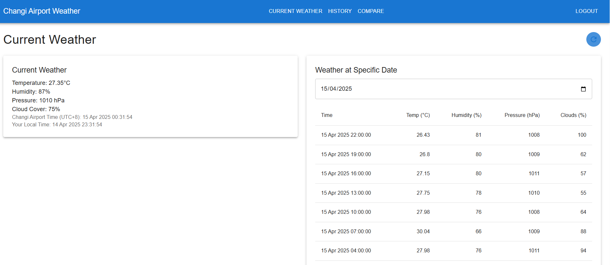
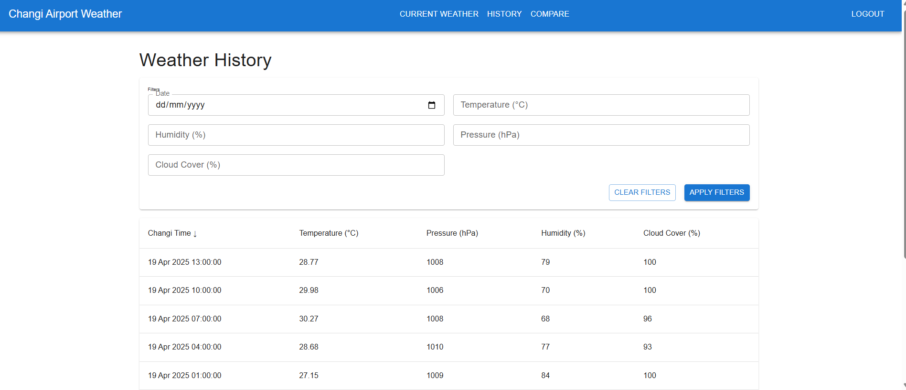
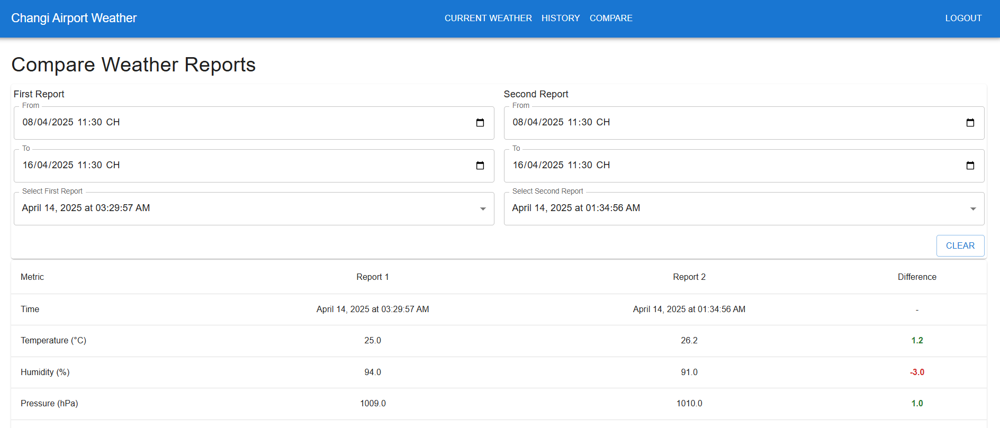

# Changi Airport Weather Report System

A full-stack application for monitoring and analyzing weather data at Changi Airport.

## Frontend Features

### Authentication
- **Login Page/Register Page**
  - Email and password authentication
  - JWT token storage
  - Remember me functionality

### Weather Monitoring
- **Current Weather**
  - Real-time weather data from Changi Airport
  - Retrieve weather forecast by date (subject to free tier limitations)
  - Temperature, humidity, pressure, and cloud cover
  - Timezone display (Singapore Time - UTC+8)

- **Historical Data**
  - Date-based weather data search
  - Limited to last 5 days (OpenWeather API free tier)
  - Data visualization in table format
  - Sorting and filtering capabilities

- **Weather Comparison**
  - Compare weather data between two dates
  - Side-by-side comparison view
  - Difference highlighting
  - Time range selection

### UI Components
- Material-UI based interface
- Responsive design
- Loading states and error handling
- Data refresh indicators

## Frontend Pages

### Current Weather Page


**Features:**
- Real-time weather display:
  - Temperature (°C)
  - Humidity (%)
  - Pressure (hPa)
  - Cloud Cover (%)
- Dual time display:
  - Changi Airport Time (UTC+8)
  - User's Local Time
- Weather at Specific Date:
  - Date picker for historical data
  - Auto-refresh button

### Weather History Page


**Features:**
- Advanced filtering system:
  - Date selection
  - Temperature range
  - Humidity range
  - Pressure range
  - Cloud Cover range
- Sortable columns:
  - Time (default sort)
  - Temperature
  - Pressure
  - Humidity
  - Cloud Cover
- Clear and Apply filter buttons

### Weather Comparison Page


**Features:**
- Dual report selection:
  - First Report date range picker
  - Second Report date range picker
- Time range selection:
  - From date/time
  - To date/time
- Comparison metrics:
  - Time comparison
  - Temperature difference
  - Humidity difference
  - Pressure difference
- Color-coded differences:
  - Green for increases
  - Red for decreases
- Clear button for resetting selection


## Backend Features

### API Endpoints
- **Authentication**
  - POST api/auth/register - User registration
  - POST api/auth/login - User authentication
  - GET api/auth/validate - Token validation
  - POST api/auth/logout - User logout

- **Weather Data**
  - GET api/weather/current - Current weather data
  - GET api/weather/history - Historical weather data
  - GET api/weather/compare - Weather comparison

### Data Management
- **Database**
  - PostgreSQL for data storage
  - Weather data caching
  - User session management

- **Caching**
  - Redis for performance optimization
  - 5-minute cache for current weather


## Setup and Running Instructions

### Prerequisites
- Node.js (v14 or higher)
- PostgreSQL
- Redis

### Step 1: Environment Configuration

#### Backend Environment Setup
1. Navigate to backend directory:
```bash
cd backend
```

2. Copy `.env.example` to `.env`:


3. Edit the `.env` file with your configuration:
```plaintext
# Database Configuration
DB_HOST=localhost
DB_PORT=5432
DB_USER=postgres
DB_PASSWORD=postgres
DB_NAME=postgres
DB_SSL=false

# Redis Configuration
REDIS_HOST=redis-19xx3.c334.asia2-1.gce.redis.com
REDIS_PORT=1943
REDIS_PASSWORD=test
REDIS_USERNAME=default

# Security
FRONTEND_URL=http://localhost:3000

# OpenWeather API
OPENWEATHER_API_KEY=test

# Server Configuration
PORT=8080

JWT_SECRET=test
JWT_EXPIRATION=1h
```

#### Frontend Environment Setup
1. Navigate to frontend directory:
```bash
cd frontend
```

2. Copy `.env.example` to `.env`:


3. Edit the `.env` file with your configuration:
```plaintext
SERVER_APP_API_URL=http://localhost:8080
```

### Step 2: Start Services

1. Start Redis
2. Start Postgres on your local

### Step 3: Run the Application

1. Start Backend:
```bash
cd backend
npm install
npm run build
npm run start
```

2. Start Frontend:
```bash
cd frontend
npm install
npm run start
```

The application will be available at:
- Frontend: http://localhost:8080
- Backend: http://localhost:3000

## Security Features

- JWT-based authentication
- Password hashing with bcrypt
- Input validation
- CORS protection

## Performance Optimizations

- Redis caching for weather data
- Efficient API response compression
- Lazy loading of components
- Memoization of expensive calculations

## License

This project is licensed under the MIT License.